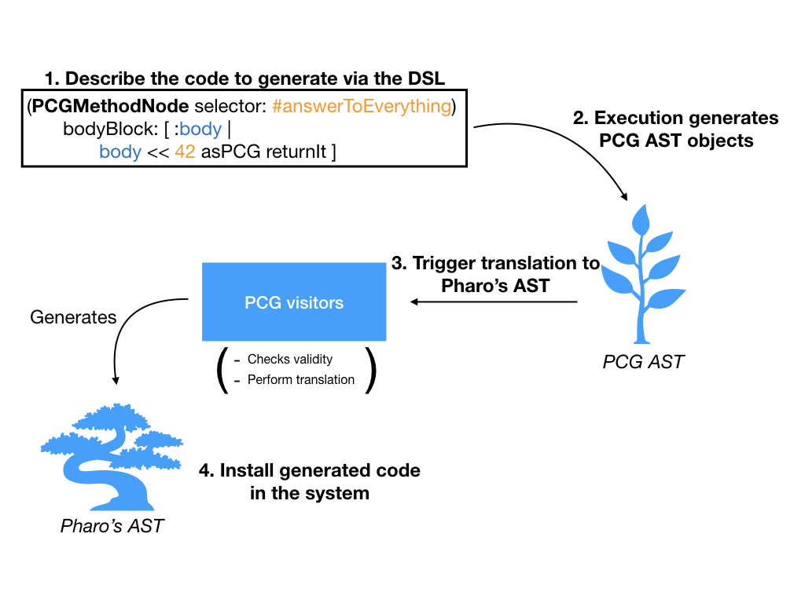
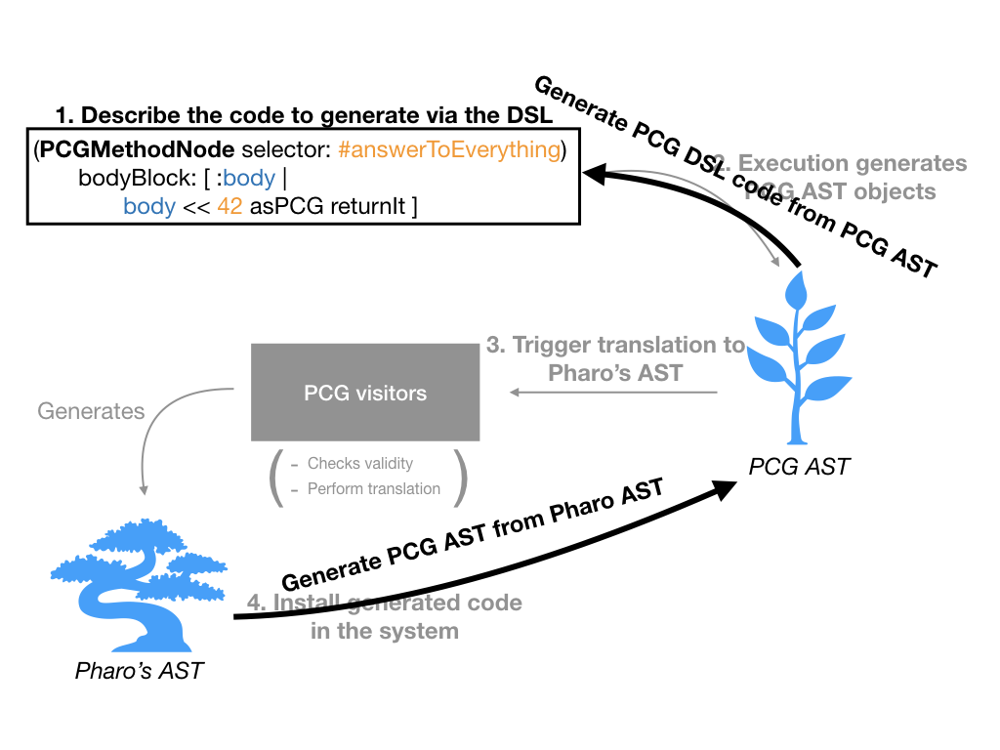

# PharoCodeGenerator
[](https://travis-ci.org/juliendelplanque/PharoCodeGenerator)
[](LICENSE)
[](https://pharo.org/download)
[](https://pharo.org/download)
[](https://pharo.org/download)

A toolkit to generate Pharo code.

- [Install](#install)
- [How it works](#how-it-works)
- [API overview](#api-overview)
- [DSL Examples](#dsl-examples)
- [Template support](#template-support)
- [Generate PCG code from an existing method in the system](#generate-pcg-code-from-an-existing-method-in-the-system)

## Install

```st
Metacello new
	repository: 'github://juliendelplanque/PharoCodeGenerator/src';
	baseline: 'PharoCodeGenerator';
	load
```

## How it works



## API overview

Consider the following code snippet:

```st
ast := (PCGMethodNode selector: #answerToEverything)
	bodyBlock: [ :body |
		body << 42 asPCG returnIt ]
```

This code generates the following method:

```st
answerToEverything
	<generated>
	^ 42
```

Here are explanations on the methods one can send to the object stored in `ast` variable:

- `ast realAst` : Builds the Pharo AST corresponding to description made in DSL
- `ast checkAst` : Checks if the AST is ready for translation to Pharo AST. Raises an error if not.
- `ast sourceCode` : Returns a String holding source code resulting from generation.
- `ast withGeneratedPragma: true|false` : Adds or not `<generated>` pragma in method source code.
- `ast protocol: aString` : Sets the protocol for the methods to be generated.
- `ast installOn: aBehaviour` : Install the method on aBehaviour object (class, meta-class, trait, etc...).

## DSL Examples
This section contains method from the system and the PCG code to generate them.

### Generating Object>>#yourself

The following source code taken `Object>>#yourself` method:

```st
yourself
  ^self
```

can be generated via the dsl:

```st
(PCGMethodNode selector: #yourself)
	bodyBlock: [ :body | body << #self asPCGNode returnIt ];
	protocol: #accessing;
	yourself
```

### Generating Collection>>#collect:

The following source code taken `Collection>>#collect:` method:

```st
collect: aBlock
  | newCollection |
  newCollection := self species new.
  self do: [:each | newCollection add: (aBlock value: each) ].
  ^newCollection
```

can be generated via the dsl:

```st
(PCGMethodNode selector: #collect: arguments: {#aBlock asPCGArgument})
	bodyBlock: [ :body | 
		body
			<<
				(#newCollection asPCGTemporary
					assign: ((#self asPCGNode receiveMessage: #species) receiveMessage: #new)).
		body
			<<
				(#self asPCGNode
					receiveMessage: #do:
					with:
						((PCGBlockNode arguments: {#each asPCGArgument})
							bodyBlock: [ :body1 | 
								body1
									<<
										(#newCollection asPCGTemporary
											receiveMessage: #add:
											with:
												(#aBlock asPCGArgument
													receiveMessage: #value:
													with: #each asPCGArgument)) ])).
		body << #newCollection asPCGTemporary returnIt ];
	protocol: #enumerating;
	yourself
```

### Generating Integer>>#&

The following source code taken `Integer>>#&` method:

```st
& aNumber
  ^self bitAnd: aNumber
```

can be generated via the dsl:

```st
(PCGMethodNode selector: #& arguments: {#aNumber asPCGArgument})
	bodyBlock: [ :body | 
		body
			<<
				(#self asPCGNode receiveMessage: #bitAnd: with: #aNumber asPCGArgument)
					returnIt ];
	protocol: #'bit manipulation';
	yourself
```

### Generating True>>#ifTrue:ifFalse:

The following source code taken `True>>#ifTrue:ifFalse:` method:

```st
ifTrue: trueAlternativeBlock ifFalse: falseAlternativeBlock
  ^trueAlternativeBlock value
```

can be generated via the dsl:

```st
(PCGMethodNode
	selector: #ifTrue:ifFalse:
	arguments:
	{#trueAlternativeBlock asPCGArgument.
#falseAlternativeBlock asPCGArgument})
	bodyBlock: [ :body | 
		body
			<< (#trueAlternativeBlock asPCGArgument receiveMessage: #value) returnIt ];
	protocol: #controlling;
	yourself
```

## Template support
PCG provides support for templating.

```st
template := (PCGMethodNode selector: #answerSelector asPCGTemplateParameter)
	bodyBlock: [ :body |
		body << #answer asPCGTemplateParameter returnIt ]
```

From a `template`, one can generate multiple methods using `#substituteParametersWith:` message:

The following substitution

```st
(template substituteParametersWith: { 
	#answerSelector -> #answerToEverything.
	#answer -> 42 asPCG }) sourceCode.
```

generates

```st
answerToEverything
	<generated>
	^ 42
```

This other substitution

```st
(template substituteParametersWith: { 
	#answerSelector -> #answerToEverythingInParallelUniverse.
	#answer -> 43 asPCG }) sourceCode
```

generates

```st
answerToEverythingInParallelUniverse
	<generated>
	^ 43
```

## Generate PCG code from an existing method in the system
If you see a method in your project that can be used as a basis for code generation, PCG can help you.



Let us import the source code of `Object>>#yourself` as a PCG AST:

```st
pcgAst := (Object >> #yourself) asPCGAST.
```

Then,

```st
pcgAst sourceCode
```

generates:

```st
yourself
	<generated>
	^ self
```

Now, one might need to retrieve the PCG script leading to the PCG AST that is able to generate `Object>>#yourself`. This can be achieve via `#meta` message.

Thus,

```st
pcgAst meta sourceCode
```

generates

```st
(PCGMethodNode selector: #yourself)
	bodyBlock: [ :body | body << #self asPCGNode returnIt ];
	protocol: #accessing;
	yourself
```

This mechanism is handy to generalize an exisiting methods in the system as a PCG template.